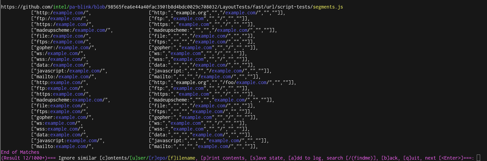

<p align="center">
  
</p>

#


## Description

GitGot is a semi-automated, feedback-driven tool to empower users to rapidly search through troves of public data on GitHub for sensitive secrets.

<p align="center">
  
</p>

### How it Works

During search sessions, users will provide feedback to GitGot about search results to ignore, and GitGot prunes the set of results. Users can blacklist files by filename, repository name, username, or a fuzzy match of the file contents.

Blacklists generated from previous sessions can be saved and reused against similar queries (e.g.,
`example.com` v.s. `subdomain.example.com` v.s. `Example Org`). Sessions can also be paused and resumed at any time.

Read more about the semi-automated, human-in-the-loop design here: https://know.bishopfox.com/blog/going-semi-automated-in-an-automated-world-using-human-in-the-loop-workflows-to-improve-our-security-tools

## Install Instructions

### Manual Instructions

[1] Install the `ssdeep` dependency for fuzzy hashing.

Ubuntu/Debian (or equivalent for your distro):
```sh
apt-get install libfuzzy-dev ssdeep
```

or, for Mac OSX:
```sh
brew install ssdeep
```
For Windows or *nix distributions without the `ssdeep` package, please see the [ssdeep installation instructions](https://ssdeep-project.github.io/ssdeep/index.html).

[2] After installing `ssdeep`, install the Python dependencies using `pip`:
```
pip3 install -r requirements.txt
```

### Docker Instructions

Run `gitgot-docker.sh` to build the GitGot docker image (if it doesn't already exist) and execute the dockerized version of the GitGot tool.

On invocation, `gitgot-docker.sh` will create and mount `logs` and `states` directories from the host's current working directory. If this `gitgot-docker.sh` is executed from the GitGot project directory it will update the docker container with changes to `gitgot.py` or `checks/`:

```sh
./gitgot-docker.sh -q example.com
```

(See `gitgot-docker.sh` for specific docker commands)
## Usage

GitHub requires a token for rate-limiting purposes. Create a [GitHub API token](https://github.com/settings/tokens) with **no permissions/no scope**. This will be equivalent to public GitHub access, but it will allow access to use the GitHub Search API. Set this token at the top of `gitgot.py` as shown below:
```sh
ACCESS_TOKEN = "<NO-PERMISSION-GITHUB-TOKEN-HERE>"
```

(Alternatively, this token can be set as the `GITHUB_ACCESS_TOKEN` environment variable)

After adding the token, you are ready to go:
```sh
# Default RegEx list and logfile location (/logs/<query>.log) are used when no others are specified.

# Query for the string "example.com" using default GitHub search behavior (i.e., tokenization). 
# This will find com.example (e.g., Java) or example.com (Website)
./gitgot.py -q example.com

# Query for the exact string "example.com". See Query Syntax in the next section for more details.
./gitgot.py -q '"example.com"'

# Query through GitHub gists
./gitgot.py --gist -q CompanyName

# Using GitHub advanced search syntax
./gitgot.py -q "org:github cats"

# Custom RegEx List and custom log files location
./gitgot.py -q example.com -f checks/default.list -o example1.log

# Recovery from existing session
./gitgot.py -q example.com -r example.com.state

# Using an existing session (w/blacklists) for a new query
./gitgot.py -q "Example Org" -r example.com.state
```
### Query Syntax

GitGot queries are fed directly into the GitHub code search API, so check out [GitHub's documentation](https://help.github.com/en/articles/searching-code) for more advanced query syntax.

### UI Commands
* **Ignore similar [c]ontent:** Blacklists a fuzzy hash of the file contents to ignore
future results that are similar to the selected file
* **Ignore [r]epo/[u]ser/[f]ilename:** Ignores future results by blacklisting selected strings
* **Search [/(mykeyword)]:** Provides a custom regex expression with a capture group to searches on-the-fly (e.g., `/(secretToken)`)
* **[a]dd to Log:** Add RegEx matches to log file, including all on-the-fly search results from search command
* **Next[\<Enter\>], [b]ack:** Advances through search results, or returns to previous results
* **[s]ave state:** Saves the blacklists and progress in the search results from the session
* **[q]uit:** Quit
